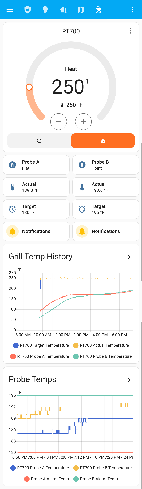
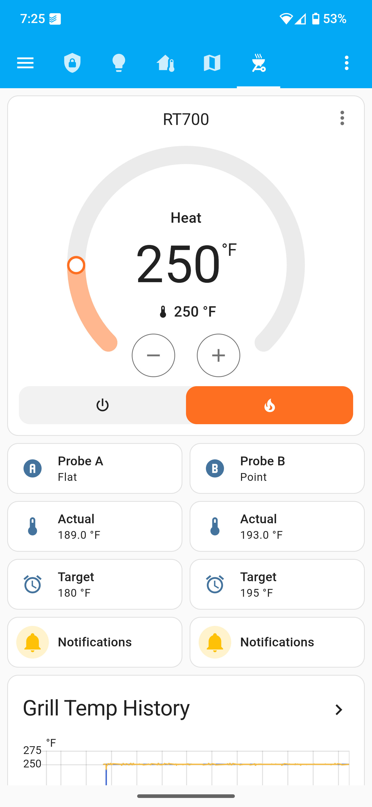
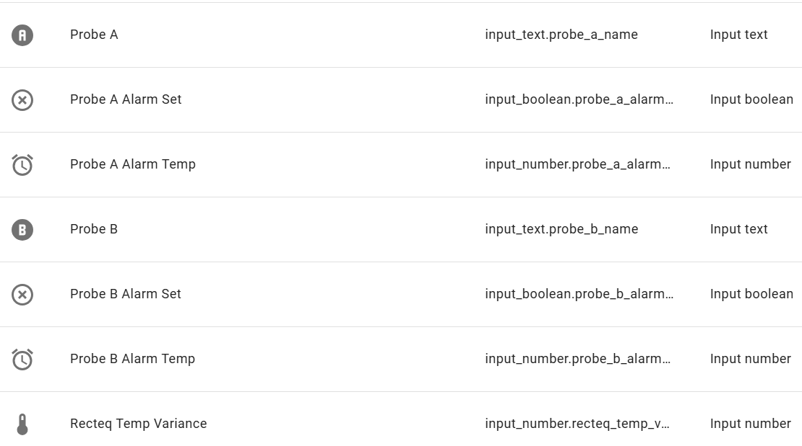
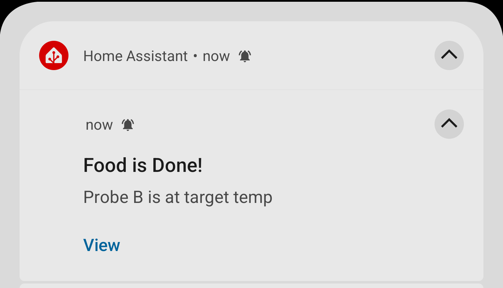

# Home Assistant Recteq Integration

> This was an abandoned fork that was picked up by others including mochman who made some great improvements. However, I needed to modify it to get my RT700 working and I am hoping to add some capabilities and make this integration more robust for most users. I will need feedback to capture the changes though as I only have one grill to test on :)

Custom integration for [recteq][recteq] grills and smokers providing a climate
entity to control the unit and sensor entities for the probes.

[](https://github.com/custom-components/hacs)
[](https://github.com/eclipse1482/recteq/issues)
[](https://github.com/eclipse1482/recteq/issues)
[](https://github.com/eclipse1482/recteq/releases/latest)
[](https://github.com/eclipse1482/recteq/commit/main)
[](https://github.com/eclipse1482/recteq/blob/main/LICENSE)
[](https://github.com/eclipse1482/recteq/commits/main)

> **NOTE** - This isn't supported or approved by [recteq][recteq] at all!




## Installation

We recommend you install [HACS](https://hacs.xyz/) first, then add
<https://github.com/eclipse1482/recteq> as a custom integration repository and
finally, add the integration from there.

Instead, if you prefer the manual route, you could download a copy of the
[latest release][latest] and unpack the contents into into
`config/custom_components/recteq/` on your HA machine. Feeling adventurous?
Using `git clone` in `config/custom_components/` to pull the project from
Github works too.

In either case, you need to restart HS once it's installed. Then you need to
[configure](#configuration) it.

## Configuration

This integration is configured using the UI only; no changes in
`configuration.yaml` are needed. Navigate to **Configuration** &raquo;
**Integrations** and tap the red "+" button in the bottom-right. Search for and
select the "Recteq" entry in the list of available integrations to setup.
You'll get the dialog shown below. Enter the details for your grill and tap
"Submit".


Repeat the process if you have multiple grills to control. _(ps: I'm jealous!)_

See the [wiki](https://github.com/eclipse1482/recteq/wiki) for info in where to get
the IP address, device ID and local key values needed.

The "Force Fahrenheit" option was added for folks who operate HA in Celsius but
cook in Fahrenheit. The climate and sensor entities will report temperatures in Fahrenheit rather than converting them to Celsius when this option is set. The
thermostat card will still display °C but the values will actually be °F.

## User Interface

I use the stock [Thermostat Card](https://www.home-assistant.io/lovelace/thermostat/)
to turn it on/off, adust temperature, and see the current state of the Recteq.

Below the Thermostat Card, I use Tile Cards to display a custom probe name, probe actual temperature, and enter probe target temperature. The probe target temperature is a Helper integer. I also have buttons to turn notifications on or off for each probe which interacts with the Notification Automations described in the next section.

Adjusting temperature can be done by dragging the temperature selector or by clicking +/-

**Low and full modes can be done by dragging the temperature slider all the way to the highest or lowest temperature settings, or by hitting plus or minus when you are at the highest or lowest temperatures that can be controlled to.**



Example yaml for Probe A Tile Cards:
```yaml
type: tile
entity: input_text.probe_a_name
features_position: bottom
vertical: false
```

```yaml
type: tile
entity: sensor.rt700_probe_a_temperature
features_position: bottom
vertical: false
name: Actual
```

```yaml
type: tile
features_position: bottom
vertical: false
entity: input_number.probe_a_alarm_temp
name: Target
```

```yaml
type: tile
entity: input_boolean.probe_a_alarm_set
features_position: bottom
vertical: false
hide_state: true
name: Notifications
icon: mdi:bell
tap_action:
  action: toggle
icon_tap_action:
  action: more-info
```
Below the Thermostat Card, I have two History Graphs. One for Grill Temperature History and one for Probe History:

```yaml
type: history-graph
entities:
  - entity: sensor.rt700_probe_a_temperature
  - entity: sensor.rt700_probe_b_temperature
  - entity: input_number.probe_a_alarm_temp
  - entity: input_number.probe_b_alarm_temp
title: Probe Temps
fit_y_data: true
grid_options:
  columns: full
hours_to_show: 1
```


```yaml
type: history-graph
entities:
  - entity: sensor.rt700_target_temperature
  - entity: sensor.rt700_actual_temperature
  - entity: sensor.rt700_probe_a_temperature
  - entity: sensor.rt700_probe_b_temperature
min_y_axis: 0
title: Grill Temp History
grid_options:
  columns: full
hours_to_show: 2
```
You will also need to create helpers for this UI to function properly. Please see the screenshot below. You will need to create:
- input_text.probe_a_name
- input_boolean.probe_a_alarm_temp
- input_number.probe_a_alarm_temp
- input_text.probe_b_name
- input_boolean.probe_b_alarm_temp
- input_number.probe_b_alarm_temp
- input_number.recteq_temp_variance (I actually don't know if this one is still needed.)



> **NOTE* - If you're using the "Force Fahrenheit" option, don't set the units
> on the input\_number or HA will try to convert it automagically.

## Notifications
Paste these scripts into your automations.yaml file. These automations send notifications for various reasons such as turning on your grill, when it is approaching target temperature. When it exceeds or falls far below target temperature. When probes are almost at temperature and at temperature. Etc.



```yaml
- id: '1626129294093'
  alias: Recteq Probe A Alarm - 5F
  description: ''
  triggers:
  - value_template: "\n  \n   True\n  \n   False\n  \n\n False\n"
    trigger: template
  conditions:
  - condition: state
    entity_id: input_boolean.probe_a_alarm_set
    state: 'on'
  - condition: numeric_state
    entity_id: input_number.probe_a_alarm_temp
    above: 0
  actions:
  - data:
      message: Probe A is 5 degrees below target temp
      title: Food is Almost Ready
      data:
        channel: recteq
        actions:
        - action: URI
          title: View
          uri: /lovelace/grill
    action: notify.all_devices
  - wait_for_trigger:
    - value_template: "\n  \n   True\n  \n   False\n  \n\n False\n"
      trigger: template
    - entity_id: sensor.rt700_probe_a_temperature
      to: unavailable
      trigger: state
    continue_on_timeout: false
    timeout: '20:00:00'
  mode: single
- id: '1626131232835'
  alias: Recteq Grill Temperature - 10F
  description: ''
  triggers:
  - value_template: "\n  \n   True\n  \n   False\n  \n\n False\n"
    trigger: template
  conditions: []
  actions:
  - data:
      message: Your grill will be ready soon. It is 10 degrees below your target temperature.
      title: Recteq - Heating up!
      data:
        channel: recteq
        actions:
        - action: URI
          title: View
          uri: /lovelace/grill
    action: notify.all_devices
  - wait_for_trigger:
    - value_template: "\n  \n   True\n  \n   False\n  \n\n False\n"
      trigger: template
      for:
        hours: 0
        minutes: 5
        seconds: 0
    timeout: '20:00:00'
    continue_on_timeout: false
  - data:
      message: Your grill has dropped 10 degrees below your target temperature
      title: Recteq - Grill has cooled!
      data:
        actions:
        - action: URI
          title: View
          uri: /lovelace/grill
        color: red
    action: notify.all_devices
  mode: single
- id: '1626140861013'
  alias: Recteq Grill Temperature + 10F
  description: ''
  triggers:
  - value_template: "\n  \n   True\n  \n   False\n  \n\n False\n"
    trigger: template
  conditions: []
  actions:
  - data:
      message: Your grill is 10 degrees above your target temperature
      title: Recteq - Warning!
      data:
        channel: recteq
        actions:
        - action: URI
          title: View
          uri: /lovelace/grill
        color: red
    action: notify.all_devices
  - wait_for_trigger:
    - value_template: "\n  \n   True\n  \n   False\n  \n\n False\n"
      trigger: template
    continue_on_timeout: false
    timeout: '20:00:00'
  - data:
      message: Your grill is back within 10 degrees of your target temperature
      title: Recteq
      data:
        channel: recteq
        actions:
        - action: URI
          title: View
          uri: /lovelace/grill
    action: notify.all_devices
  mode: single
- id: '1626380331997'
  alias: Recteq Probe B Alarm - 5F
  description: ''
  triggers:
  - value_template: "\n  \n   True\n  \n   False\n  \n\n False\n"
    trigger: template
  conditions:
  - condition: state
    entity_id: input_boolean.probe_b_alarm_set
    state: 'on'
  - condition: numeric_state
    entity_id: input_number.probe_b_alarm_temp
    above: 0
  actions:
  - data:
      message: Probe B is 5 degrees below target temp
      title: Food is Almost Ready
      data:
        channel: recteq
        actions:
        - action: URI
          title: View
          uri: /lovelace/grill
    action: notify.all_devices
  - wait_for_trigger:
    - value_template: "\n  \n   True\n  \n   False\n  \n\n False\n"
      trigger: template
    - entity_id: sensor.rt700_probe_b_temperature
      to: unavailable
      trigger: state
    continue_on_timeout: false
    timeout: '20:00:00'
  mode: single
- id: '1626380349717'
  alias: Recteq Probe B Alarm
  description: ''
  triggers:
  - value_template: "\n  \n   True\n  \n   False\n  \n\n False\n"
    trigger: template
  conditions:
  - condition: state
    entity_id: input_boolean.probe_b_alarm_set
    state: 'on'
  - condition: numeric_state
    entity_id: input_number.probe_b_alarm_temp
    above: 0
  actions:
  - data:
      message: 'Probe B is at target temp '
      title: Food is Done!
      data:
        channel: recteq
        actions:
        - action: URI
          title: View
          uri: /lovelace/grill
        color: red
    action: notify.all_devices
  - wait_for_trigger:
    - value_template: "\n  \n   True\n  \n   False\n  \n\n False\n"
      trigger: template
    - entity_id: sensor.rt700_probe_b_temperature
      to: unavailable
      trigger: state
    continue_on_timeout: false
    timeout: '20:00:00'
  mode: single
- id: '1626380490549'
  alias: Recteq Probe A Alarm
  description: ''
  triggers:
  - value_template: "\n  \n   True\n  \n   False\n  \n\n False\n"
    trigger: template
  conditions:
  - condition: state
    entity_id: input_boolean.probe_a_alarm_set
    state: 'on'
  - condition: numeric_state
    entity_id: input_number.probe_a_alarm_temp
    above: 0
  actions:
  - data:
      message: Probe A is at target temp
      title: Food is Done!
      data:
        channel: recteq
        actions:
        - action: URI
          title: View
          uri: /lovelace/grill
        color: red
    action: notify.all_devices
  - wait_for_trigger:
    - value_template: "\n  \n   True\n  \n   False\n  \n\n False\n"
      trigger: template
    - trigger: state
      entity_id:
      - sensor.rt700_probe_a_temperature
      to: unavailable
    continue_on_timeout: false
    timeout: '20:00:00'
  mode: single
- id: '1626739464825'
  alias: Recteq Grill at Temperature
  description: ''
  triggers:
  - value_template: "\n \n  True\n \n  False\n \n\n False\n"
    trigger: template
  conditions: []
  actions:
  - data:
      message: Your grill is at your target temperature
      title: Recteq Ready!
      data:
        channel: recteq
        actions:
        - action: URI
          title: View
          uri: /lovelace/grill
        sticky: false
    action: notify.all_devices
  - wait_for_trigger:
    - value_template: "\n  \n   True\n  \n   False\n  \n\n False\n"
      trigger: template
    continue_on_timeout: false
    timeout: '20:00:00'
  mode: single
```

## Change Log

* _future_
* 1.0.0
  * Fix error for async_forward_entry_setup being deprecated 
  * Add low and full modes
* 0.2.1
  * Fixing DPS for RT700
  * Fixed Tuya Protocol 3.4 and ability for Local Key to use more the hex digits for new controllers
  * Fixed issue that caused Home Assistant to slow down significantly when integration was enabled, but grill was offline
  * Adding drop down to select Tuya Protocol and Grill Type which will dynamically point the correct data points to probe names (I will need help to make sure I align them correctly so this will be a work in progress)
  * Fixed Device Key Length
  * Fixed Probe Temps
  * Switched to tintuya for data reading
* 0.0.4
  * Metric units support
  * Force-Fahrenheit option
* 0.0.3 
  * Added target & actual sensors
  * Sensors and current temperature report "unavailable" when off.
  * Added UI usage to README
  * Bugfixes and cleanup.
* 0.0.2 
  * HACS support
  * README additions
* 0.0.1 
  * Initial release candidate
  * Works for me. Looking for others to test.

## License

MIT

See [LICENSE](LICENSE) for details.

## Support

Submit [issues](https://github.com/mochman/recteq/issues) for defects, feature
requests or questions. I'll try to help as I can.

I am *very* interested in feedback on this to know whether it's working for
others.

## Credits

This is forked from mochman (https://github.com/mochman) who forked the repo by Paul Dugas, <paul@dugas.cc>.

Paul Dugas learned this was possible from [`SDNick484/rectec_status`][rectec_status] and
based the intial versions of the project on his examples. Much thanks to
[mochman](https://github.com/mochman/),
[SDNick](https://github.com/SDNick484/) along with those he credits;
[codetheweb](https://github.com/codetheweb/),
[clach04](https://github.com/clach04),
[blackrozes](https://github.com/blackrozes),
[jepsonrob](https://github.com/jepsonrob), and all the other contributors on
tuyapi and python-tuya who have made communicating to Tuya devices possible
with open source code.

[recteq]: https://www.recteq.com/
[latest]: https://github.com/mochman/recteq/releases/latest
[rectec_status]: https://github.com/SDNick484/rectec_status
